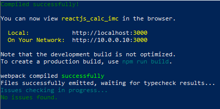

# Calculadora IMC em React Native

#### Este é um projeto de uma Calculadora de IMC desenvolvida em React Native. Com ela é possível calcular o Índice de Massa Corporal (IMC) de uma pessoa.

## Como usar

####  1 - Clone o repositório em sua máquina local com o seguinte comando:

`git clone https://github.com/cosmeaf/react-native-calculadora-imc.git`

#### 2 -  Acesse a pasta do projeto:
`cd react-native-calculadora-imc`

#### 3 - Instale as dependências do projeto:
`npm install`
#### OU
`yarn install`

#### 4 - Após realizar a instalação dos pacotes, inicio o projeto!
`npm start`

#### Devera aparecer uma mensagem parecida como essa:

## Contribuição

#### Se você deseja contribuir para este projeto, basta seguir os passos abaixo:

* Realize um fork do repositório.
* Clone o fork em sua máquina local.
* Crie uma nova branch para suas modificações:

`git checkout -b minha-nova-feature`

* Faça as alterações necessárias e teste-as.
* Faça um commit das suas modificações:

`git commit -m "Minha nova feature"`

* Faça um push das suas modificações para o seu fork:

`git push origin minha-nova-feature`

* Crie uma pull request para o repositório original.
* Aguarde a análise e aprovação da sua pull request.

## Licença
#### Este projeto está sob a licença MIT.